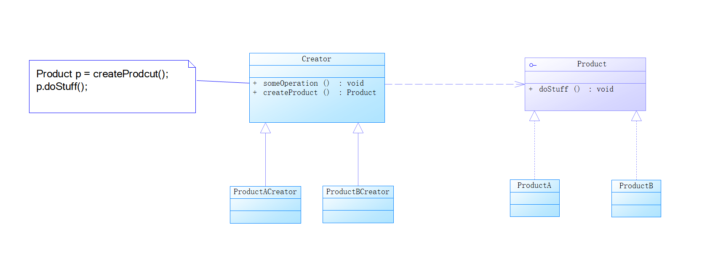
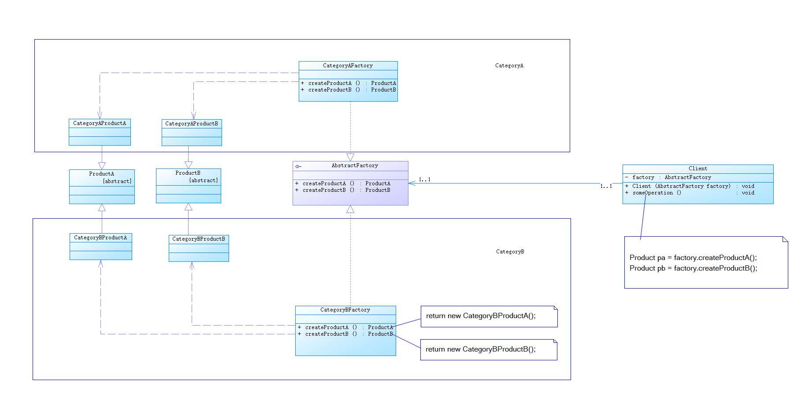
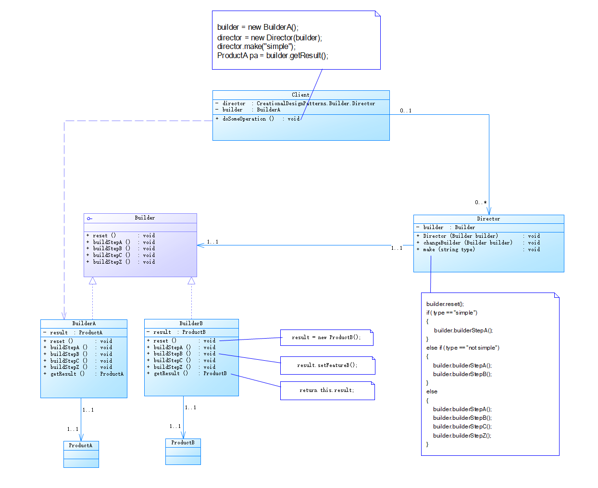
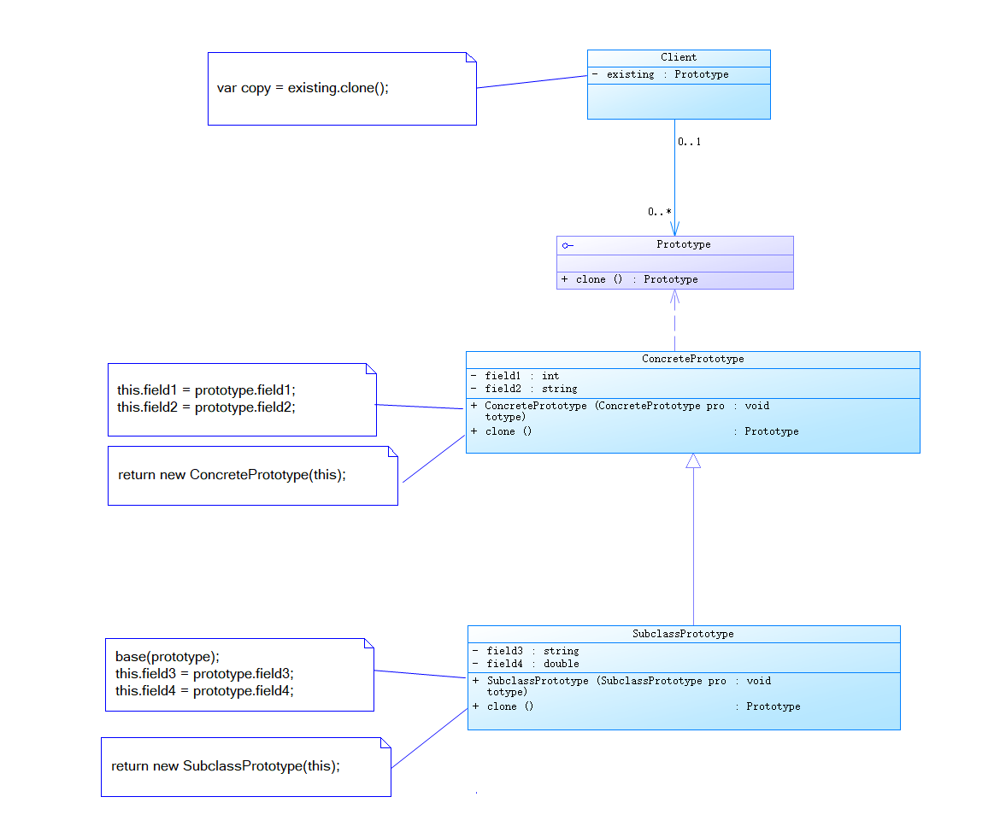
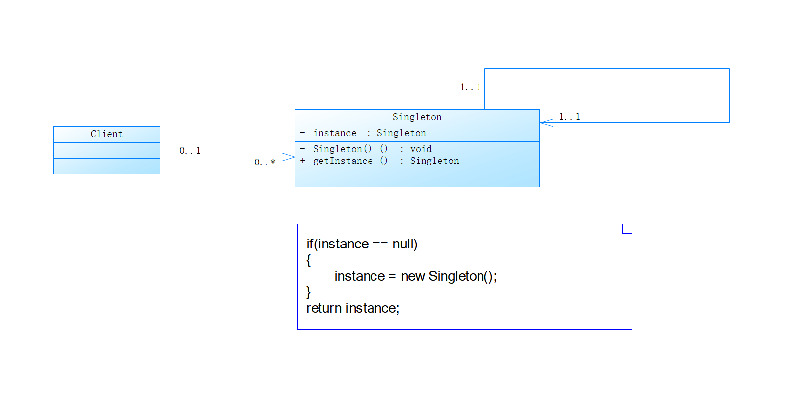

<h1 align="center">设计模式库</h1>

 33 Design Patterns • 73 moderately realistic examples

## 什么是设计模式?

想象一下：

1. **盖房子的“套路”经验包：**
   
   - 你是个建筑师，要盖各种房子（写程序）。
   
   - 盖了无数房子后，你发现：**某些特定的问题（比如采光不好、空间利用率低、结构不稳）会反复出现。**
   
   - 为了解决这些**反复出现的特定问题**，你和其他有经验的建筑师们总结出了一套又一套**经过验证的、高效的、可复用的解决方案蓝图**。
   
   - 这些蓝图不是具体的施工图（不是具体代码），而是**解决问题的思路、原则和关键步骤的模板**。比如：
     
     - **问题：** 客户想要一个采光好又私密的客厅。
     
     - **经验套路/模式：** “**落地窗+百叶帘**”组合（这是一种模式）。它告诉你在哪里开窗、用什么帘子，既保证光线又能遮挡视线，但不规定窗框颜色、帘子品牌。
     
     - **下次遇到类似需求，直接套用这个“模式”**，省时省力效果好，不用每次都重新发明轮子。

2. **武林高手的“招式套路”：**
   
   - 你是个学武的（程序员）。
   
   - 打架（写代码）时，面对敌人不同的进攻方式（不同的编程问题），光靠王八拳（想到哪写到哪）效率低、容易被打败（代码难维护、易出错）。
   
   - 武术大师们（资深程序员）经过无数实战，总结出了一些**应对特定战斗场景的标准、高效、优雅的“招式组合”**（设计模式）。
   
   - 比如：
     
     - **场景：** 敌人从背后偷袭（需要灵活创建不同对象）。
     
     - **招式套路/模式：** “**回马枪**”（比如 **工厂模式**）。它教你在转身的同时如何发力、刺枪的角度和时机，有效反击偷袭者（优雅地创建对象），而不是每次被偷袭都慌慌张张临时想对策（写一堆混乱的`new`）。
   
   - **学会这些“招式套路”，遇到对应场景就能熟练使出，事半功倍。**

**所以，简单总结设计模式就是：**

> **它们是软件工程领域，由前辈高手们总结出来的、用于解决在软件设计中** **反复出现的、特定类型问题** **的、** **最佳实践方案模板** **。**
> 
> - **解决什么问题？** 代码结构混乱、难以维护、难以扩展、难以复用、效率低下等常见痛点。
> 
> - **谁总结的？** 无数有经验的程序员（尤其是“四人帮”GoF那本书）。
> 
> - **本质是什么？** 不是具体的代码，而是**高层次的、可复用的设计思路和蓝图**。它告诉你“**在这种情况下，通常这样组织你的类和对象，会比较好**”。
> 
> - **目的是什么？**
>   
>   - **提高代码质量：** 让代码更清晰、更灵活、更健壮、更容易理解和修改（可维护性）。
>   
>   - **提高开发效率：** 避免重复造轮子，遇到常见问题有成熟方案直接套用。
>   
>   - **促进团队沟通：** 大家说“这里用个单例模式”，所有人都秒懂背后的设计意图，沟通成本大大降低。

**关键类比：**

- **菜谱：** 告诉你做“鱼香肉丝”的标准步骤（模式），但你可以根据口味微调料量（具体实现）。设计模式就是“写优雅健壮代码的菜谱”。

- **棋谱：** 围棋/象棋中的经典开局和应对招式（模式）。高手都懂这些棋谱，在特定局面下能快速选择最优策略。设计模式就是“软件设计这盘棋的棋谱”。

- **工具箱里的标准工具：** 螺丝刀（单例模式）、扳手（工厂模式）、锤子（建造者模式）。每种工具（模式）都是为了解决特定类型的问题（拧螺丝、固定螺母、敲钉子）而设计的最佳工具。你用对了工具，干活就轻松高效。

**记住核心：**

- **不是银弹：** 设计模式不是万能的，不能滥用。只在它适用的场景（反复出现的特定问题）下使用才有效。

- **重在理解思想：** 不要死记硬背代码结构，要理解它**解决什么痛点**以及**为什么这样设计能解决**。

- **先模仿后创新：** 就像练武术先学套路一样，学编程先理解和应用这些成熟模式，融会贯通后，才能达到“无招胜有招”的境界，根据实际情况灵活变通甚至创造新模式。

**一句话最通俗版：**

> **设计模式就是编程高手们总结的“套路”，专门用来优雅、高效地解决那些写代码时经常遇到的“老毛病”、“老难题”。学会这些套路，你的代码就能从“野路子”变成“正规军”，更好写、更好懂、更好改！**

## 设计模式分类

设计模式主要分为一下几类:

### 🧱 **1. 创建型设计模式：解决“对象怎么生出来？”的问题**

> **核心：控制对象的创建过程，让“造东西”更灵活、更合理。**  
> **类比：工厂生产产品的不同方式。**

- **单例模式**：  
  → *“全球限量1辆的顶级跑车”*  
  整个公司（程序）只能有一辆CEO专用车（唯一实例），谁要用车都找这同一辆。

- **工厂模式**：  
  → *“汽车工厂流水线”*  
  你说“我要SUV”（传参数），工厂就给你造一台SUV；你要轿车，就造轿车。**你不需要知道流水线怎么焊接的（隐藏创建细节）**。

- **建造者模式**：  
  → *“定制高端电脑”*  
  客服（建造者）一步步问你：CPU要i7还是i9？内存32G还是64G？显卡用哪款？... **分步骤组装复杂对象**，避免你买整机后自己拆装。

- **原型模式**：  
  → *“复印机”*  
  已有1份完美合同（原型对象），下次需要新合同时直接复印（克隆），改个名字日期就能用，**省去重写所有条款的时间**。

**总结：创建型模式 = 造东西的“聪明方法”**  
👉 避免到处写 `new`，解决“创建对象”时的灵活性、复杂度问题。

---

### 🧩 **2. 结构型设计模式：解决“对象怎么组装？”的问题**

> **核心：把多个对象组合成更大结构，让协作更高效、更稳定。**  
> **类比：搭积木或装修房子的技巧。**

- **适配器模式**：  
  → *“电源转换插头”*  
  你的中国插头（对象A）没法插欧洲插座（对象B）。转换头（适配器）在中间一转接，立刻通电！

- **装饰器模式**：  
  → *“给手机加配件”*  
  手机壳 + 镜头膜 + 游戏手柄... **层层叠加功能**，不拆原手机（不修改原有类）。

- **代理模式**：  
  → *“明星经纪人”*  
  你想找明星（核心对象）拍广告？先联系经纪人（代理）。经纪人负责安排档期、过滤垃圾请求（安全控制/延迟访问）。

- **组合模式**：  
  → *“公司组织架构”*  
  部门（树枝节点）包含员工（叶子节点）。你发通知时，只需发给CEO（根节点），消息自动层层下达到所有员工（统一处理树形结构）。

- **外观模式**：  
  → *“智能家居遥控器”*  
  看电影时，按1个键：自动关灯（对象A）+ 降窗帘（对象B）+ 开投影（对象C）。**简化复杂系统的调用入口**。

**总结：结构型模式 = 拼装对象的“连接术”**  
👉 让多个独立对象组合出更强功能，解决“扩展性”和“复用性”问题。

---

### 🎭 **3. 行为型设计模式：解决“对象之间怎么互动？”的问题**

> **核心：管理对象间的通信、职责分配和流程控制。**  
> **类比：团队协作的规则和流程。**

- **观察者模式**：  
  → *“微信公众号订阅”*  
  你关注了某个公众号（被观察者），它一发文（状态变化），所有粉丝（观察者）自动收到推送（通知）。

- **策略模式**：  
  → *“导航软件的路线选择”*  
  去机场可选：*最快路线*、*最省钱路线*、*避开高速路线*（不同策略）。一键切换算法，不修改导航核心代码。

- **命令模式**：  
  → *“餐厅点餐订单”*  
  你点的菜（命令对象）交给服务员（调用者），服务员转给厨师（接收者）。**解耦点餐人和做菜人**，支持撤销（退菜）或排队。

- **责任链模式**：  
  → *“公司审批流程”*  
  报销单先交组长 → 金额超限转交经理 → 再超限转交总监。**每个领导（对象）只处理自己能批的额度**，传递下去。

- **状态模式**：  
  → *“红绿灯自动切换”*  
  红灯（状态A）变绿灯（状态B）时，切换后**行为自动改变**（停→行），无需写一堆 `if-else` 判断当前状态。

**总结：行为型模式 = 对象间的“协作术”**  
👉 让多个对象有条不紊地配合工作，解决“通信”和“流程控制”问题。

---

### 🧠 **终极总结：一张表看懂三类模式**

| **类型**  | **核心问题** | **生活比喻**     | **经典模式举例** |
| ------- | -------- | ------------ | ---------- |
| **创建型** | 对象怎么创建？  | 生产产品（工厂/定制）  | 单例、工厂、建造者  |
| **结构型** | 对象怎么组装？  | 搭积木/装修（组合结构） | 适配器、装饰器、代理 |
| **行为型** | 对象怎么协作？  | 团队分工（流程与通信）  | 观察者、策略、责任链 |

> 💡 **简单记忆法**：
> 
> - **创建型** → 关注 **出生**（new 对象）
> 
> - **结构型** → 关注 **组合**（对象之间的关系）
> 
> - **行为型** → 关注 **互动**（对象之间的对话）

就像盖房子：

1. **创建型**决定砖头怎么烧制（单例：只有一种特制砖；工厂：按需造不同砖）

2. **结构型**决定砖如何砌成墙（适配器：连接不同尺寸的砖；装饰器：给墙贴瓷砖）

3. **行为型**决定房间如何协作（观察者：厨房烟雾报警通知客厅；策略：空调根据模式制冷/制热）

掌握这三类模式，你的代码就从“乱搭窝棚”升级到“建造摩天大楼”了！

#下面介绍创建型(Creational)设计模式:

### 🧱 一、创建型模式：武林中的“秘籍传承体系”

创建型模式的核心是**如何高效、灵活地“创造对象”**，就像武林中不同门派如何传承独门武功：

- **核心问题**：避免直接用 `new` 反复造轮子，而是通过合理设计，让对象的创建更可控、更复用。

- **武林隐喻**：高手不是天生就会武功，而是通过秘籍、师父或顿悟获得能力。不同门派（设计模式）的“授功方式”决定了武学修为的**独特性、系统性和传承效率**24。

---

### ⚙️ 二、具体模式与天龙八部武学比喻

#### 1. **单例模式 → 葵花宝典：独步天下的唯一绝学**

- **秘籍特点**：练成者当世仅能有一人，强行多人修炼必致走火入魔（多线程冲突）16。

- **设计模式核心**：确保一个类全局只有一个实例，并提供统一访问点。

- **天龙比喻**：
  
  - **萧峰的降龙十八掌**：天下至刚至阳的武功，但真正练至化境的只有萧峰一人。聚贤庄大战中，他一人独战群雄，正如单例在系统中“唯一且全局可用”37。
  
  - **破解多线程（防走火）**：
    
    - 饿汉式 → 扫地僧提前练好《易筋经》，随时可用（类加载即初始化）；
    
    - 双重校验锁 → 萧峰在少室山大战中，先“试探虚实”（第一次判空），再“以掌封路”（synchronized锁），最后“雷霆一击”（创建实例）46。

| **武林比喻** | **设计模式**  | **核心特点**        | **使用场景**    |
| -------- | --------- | --------------- | ----------- |
| 葵花宝典唯一传人 | 单例模式      | 全局唯一实例，统一访问入口   | 配置管理、数据库连接池 |
| 萧峰的降龙十八掌 | 饿汉式/双重校验锁 | 线程安全，延迟加载或立即初始化 | 高并发环境下的资源管理 |

#### 2. **工厂模式 → 少林七十二绝技：分门别类的武学流水线**

- **简单工厂：罗汉堂基础教学**
  
  - 少林罗汉堂弟子入门，师父根据资质（参数）直接传授“伏虎拳”或“拈花指”（返回不同对象）29。
  
  - **缺点**：新增“无相劫指”需修改师父教案（违反开闭原则）。

- **工厂方法：达摩院专精培养**
  
  - 达摩院分“拳术部”、“指法部”，各部首座（具体工厂）负责传授专精武功（如玄悲大师教“大韦陀杵”）。
  
  - **优点**：要新增“刀法部”，只需加一个新首座，不动原有结构49。

- **抽象工厂：全套武学体系传承**
  
  - 扫地僧代表“藏经阁体系工厂”，可生产配套内功（《易筋经》）、外功（《金刚不坏体》）、轻功（《一苇渡江》），风格统一，避免混搭走火710。
  
  - **对比工厂方法**：若分开学，虚竹得找无崖子学内功、童姥学外功——抽象工厂像逍遥派“一键打包传功”10。

#### 3. **建造者模式 → 虚竹学天山六阳掌：分步组装，终成绝技**

- **核心思想**：将复杂对象的构建拆解为多个步骤，由“导演”控制流程9。

- **天龙比喻**：
  
  - **童姥教虚竹**：  
    ① 散功 → 化去少林内力（`reset()`）；  
    ② 练气 → 引导北冥真气（`buildEnergy()`）；  
    ③ 练招 → 学六阳掌招式（`buildSkills()`）；  
    ④ 融合 → 生死符大成（`getResult()`）。
  
  - 若跳过“散功”强练，则如程序跳过初始化必崩溃310。

#### 4. **原型模式 → 慕容复“以彼之道，还施彼身”**

- **核心思想**：复制现有对象，而非新建。分浅复制（只抄招式）和深复制（连内力一起复制）69。

- **天龙比喻**：
  
  - **王语嫣口述武功**：她熟读万卷武学（原型对象），段誉临敌时“复刻”她的指点（`clone()`）使出招式，省去自创时间10。
  
  - **游坦之吸冰蚕毒**：继承冰蚕寒毒（浅拷贝），但未掌握运用方法，反遭反噬——如复制对象未完全克隆依赖项。

---

### 💎 三、总结：设计模式与武学的共鸣

创建型模式的本质是**控制对象的生成方式**，恰似武林门派控制武学传承的途径：

| **模式** | **核心思想**  | **武林隐喻**      | **适用场景**      |
| ------ | --------- | ------------- | ------------- |
| 单例模式   | 唯一实例，全局访问 | 葵花宝典唯一传人      | 全局配置、资源池      |
| 工厂模式   | 分离创建与使用逻辑 | 少林分院教学体系      | 多类对象统一创建入口    |
| 建造者模式  | 分步构建复杂对象  | 童姥分步传授虚竹逍遥派武学 | 多参数、多配置的对象初始化 |
| 原型模式   | 复制替代新建    | 慕容复复制对手武功反击   | 创建成本高、结构相似的对象 |

> 💡 **金庸的启示**：如虚竹因“无崖子传功”瞬间获得内力（原型模式），但若不懂运用（未重写克隆方法），仍难敌丁春秋。设计模式是“心法”，代码是“招式”，心法通透，方能以无招胜有招510。

若说代码是江湖，那创建型模式就是各派“授功秘术”——掌握它们，你也能像逍遥派掌门一样，随心所“造”，无惧复杂度挑战。

---

- 工厂方法 Factory Method

- 抽象工厂 Abstract Factory

- 建造者 Builder

- 原型 Prototype

- 单例 Singleton

